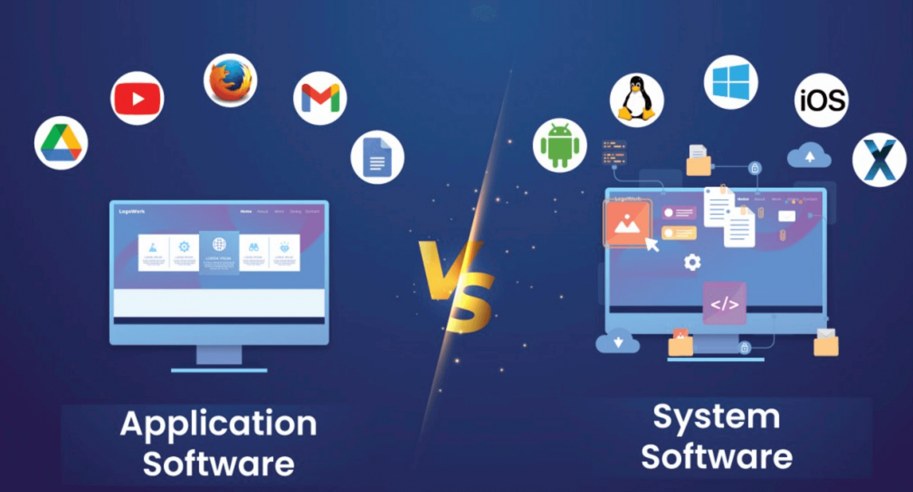

# 1.Application Software vs System Software

## Application Software

### Definition:
Application software is designed to help users perform **specific tasks** like creating documents, editing images, or browsing websites.

### Simple Words:
Ye software **user ke kaam ke liye** banta hai – jaise typing karna, photo edit karna, ya YouTube chalana.

### Real-World Examples:
- Microsoft Word – for typing documents  
- Adobe Photoshop – for editing images  
- Google Chrome – for browsing the internet  
- VLC Media Player – for watching videos

### Important Points:
- User-oriented software  
- Cannot run without system software  
- Task-specific (one app = one job)  

---

## System Software

### Definition:
System software **controls and manages** computer hardware and provides a platform to run application software.

### In Simple Words:
Ye software computer ko **control karta hai** aur application software ko chalne ka **environment deta hai**.

### Real-World Examples:
- Operating Systems: Windows, macOS, Linux  
- Device Drivers: Printer Driver, Graphics Driver  
- Utilities: Disk Cleanup, Antivirus  

### Important Points:
- Hardware ko manage karta hai  
- Background me kaam karta hai  
- Application software is dependent on it  
- Boot time pe sabse pehle load hota hai  

---

---

### Visual: Application Software vs System Software  

---

## Short Real-World Explanation

### Application Software – Jaise Tools
> **Jaise: MS Word** – document likhne ka tool  
> **Jaise: Chrome** – internet chalane ka tool  
> **Jaise: VLC Player** – video dekhne ka tool  
🛠️ *Socho inhe tum kaam ke liye khud chalate ho.*

---

### System Software – Jaise Machine ka System
> **Jaise: Windows ya macOS** – pura computer chalane ka system  
> **Jaise: Printer Driver** – printer ko samjhane wala software  
> **Jaise: Antivirus** – system ko safe rakhne wala software  
 *Socho ye background me kaam karta hai taaki tools (apps) sahi se kaam karein.*

---

### Computer as a Real-World Analogy:
> **Computer = Restaurant**  
> - **System Software = Kitchen, Electricity, Staff**  
> - **Application Software = Pizza, Pasta, Juice (jo tum order karte ho)**

---

## 2.What is an Operating System?

### Definition:
An operating system is a piece of software that **manages all the resources** of a computer system—both **hardware and software**—and provides an environment in which the user can **execute programs conveniently and efficiently**.

It hides the **underlying complexity of the hardware** and acts as a **resource manager**.

### In Simple Words:
Operating system wo software hai jo **poore computer system ko control karta hai** — hardware, software, files, memory sab kuch — taaki user **asaani se programs chala sake** bina hardware ke complex logic ke.

### Key Points:
- Resource manager for CPU, memory, storage, etc.  
- Provides interface between user and hardware  
- Makes execution of programs smooth and safe  
- Examples: Windows, Linux, macOS, Android  

---

## 3.Why Operating System?

### 1. What if there is **no OS**?

#### a. Bulky and Complex Applications:
> Har application ko hardware se khud interact karna padega. Har app ka size aur complexity badh jaayegi.

#### b. Resource Exploitation by One App:
> Agar OS na ho, to ek hi app sabhi hardware resources le sakta hai — CPU, memory, etc.

#### c. No Memory Protection:
> Ek program doosre program ke memory area ko overwrite kar sakta hai. Ye system crash ya data loss ka reason ban sakta hai.

---

### 2. What is an OS made up of?

#### a. Collection of System Software:
> OS ek software nahi, balki **multiple system software ka collection** hota hai — jaise memory manager, process scheduler, file system, I/O controller, etc.

---

## 4.Functions of Operating System

### 1. Access to Computer Hardware
> OS hardware ko access karne ka tareeka deta hai — jaise keyboard, mouse, disk, display, etc.

*Real-life: Socho OS ek hotel manager hai jo kitchen (hardware) ka access sirf authorized staff (apps) ko deta hai.*

---

### 2. Interface Between User and Hardware
> OS user ko ek **simple interface** deta hai taaki user bina hardware logic samjhe kaam kar sake.

*Real-life: Jaise ATM machine — aapko sirf buttons dikhte hain, andar jo ho raha hai wo OS handle karta hai.*

---

### 3. Resource Management (Aka Arbitration)
> OS CPU, memory, I/O devices, file system, security, and processes ko **manage karta hai** aur sabko fair access deta hai.

*Real-life: Socho traffic police — sabko apna signal ke time pe cross karne ka mauka deta hai. Waise hi OS resources manage karta hai.*

---

### 4. Hides Underlying Hardware Complexity (Aka Abstraction)
> OS hardware ki complexity ko **chhupa deta hai** aur ek simple programming interface deta hai.

*Real-life: TV remote — andar kya circuit hai wo nahi pata, aap sirf button dabate ho. Waise hi OS complex hardware ko simple bana deta hai.*

---

### 5. Facilitates Execution of Application Programs with Isolation and Protection
> OS ensures ki har program **secure aur alag environment** me chale, taaki ek app doosre ko interfere na kare.

*Real-life: Jaise har student ka exam room alag hota hai — koi cheating na kare. Waise hi OS har app ko alag rakhta hai.*

---

### InShort:
> The operating system provides the **means for proper and safe use of resources** during computer operations.

